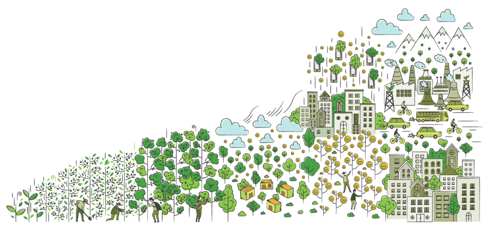

# Treejer Protocol Smart Contracts

Treejer Protocol Smart Contracts is a lightweight implementation of the [Treejer Protocol](treejer.com) on Polygon

In-depth documentation on Treejer protocol and the latest deployed contracts addresses are available at [Treejer Docs](https://docs.treejer.com/smart-contracts)

Visit [Treejer Blog](http://blog.treejer.com) for more details into the |Treejer and how it works

## Local Development

The following assumes the use of `node@>=13`.

### Install Dependencies

`npm install`

### Start Ganache

`npm run ganache`

### Test

`npm run test`

### Deploy on local ganache

`npm run deploy`

## How to Contribute

To chat with us & stay up to date, join our [Discord](https://discord.gg/8WuVd2ERC2).

Vulnerabilities should be disclosed directly to the Treejer team by emailing [here](https://security@treejer.com).

_© Copyright 2021, Treejer_
